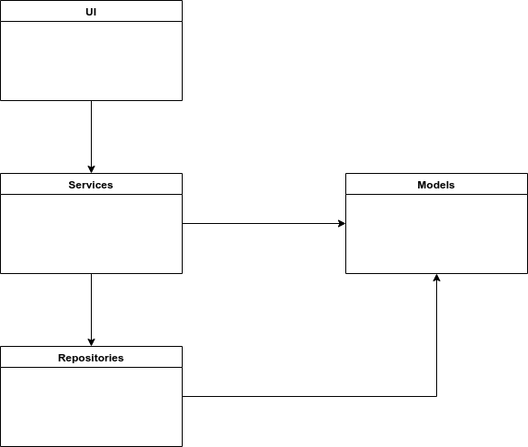
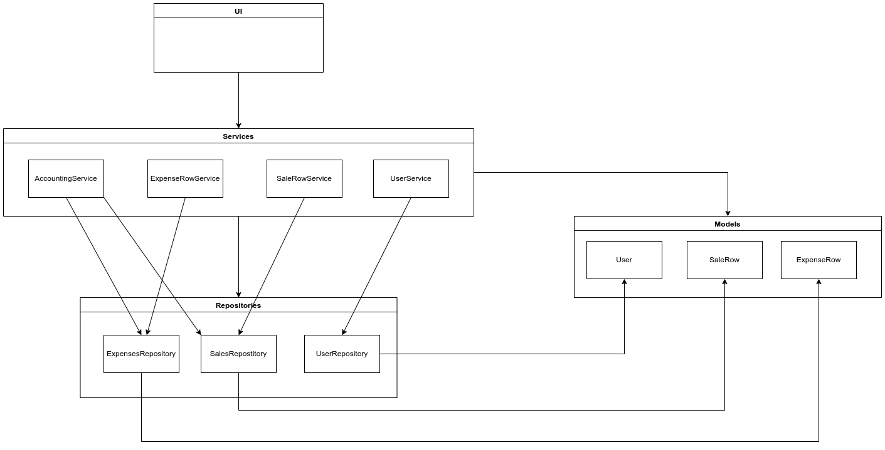
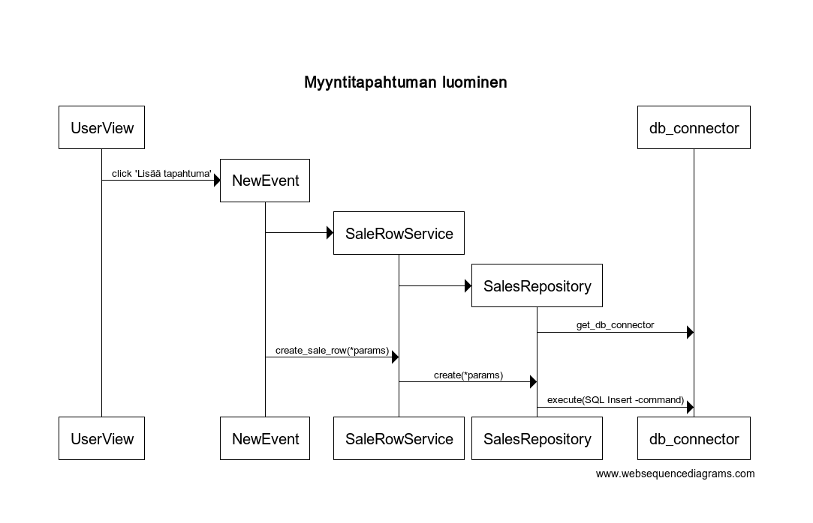

### Pakkauskaavio

### Pakkauskaavio luokilla

### Toiminnallisuudet

#### Myyntitapahtuma

Käyttäjä pystyy luomaan myyntitapahtuman klikkaamalla käyttäjänäkymän (`UserView`) 'Lisää tapahtuma' -painiketta. Painike ohjaa formille, mistä valitaan tyypiksi 'Myynti' (oletusvalinta) ja syötetään pyydetyt tiedot:
- Päivämäärä
- Summa (sisältäen alvin). Erottimeksi käy piste tai pilkku, ohjelma huomioi korkeintaan kaksi desimaalia
- Alv-kanta, vaihtoehtoina 24%, 14%, 10% tai 0%
- Kuvaus. (merkkimäärä 1-50 merkkiä)

Formi informoi käyttäjää mahdollisten virheellisten syötteiden tapahtuessa. Kun tiedot on syötetty, tapahtuman saa lisättyä 'Lisää tapahtuma' -painikkeen avulla. Painike kutsuu `add_event`-metodia, joka validoi syötteet ja jos syöte on ok, lisätään tapahtuma tietokantaan. `UserView` kutsuu `SaleRowService`-luokan metodia `create_sale_row`, joka puolestaan kutsuu `SalesRepository`-luokan metodia `create`. Metodi lisää rivin sqlite3 connectorilla (`db_connector`) tietokantaan `Sales`-tauluun. Tapahtuma kuvattu alla sekvenssikaavion avulla.

