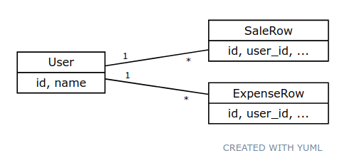
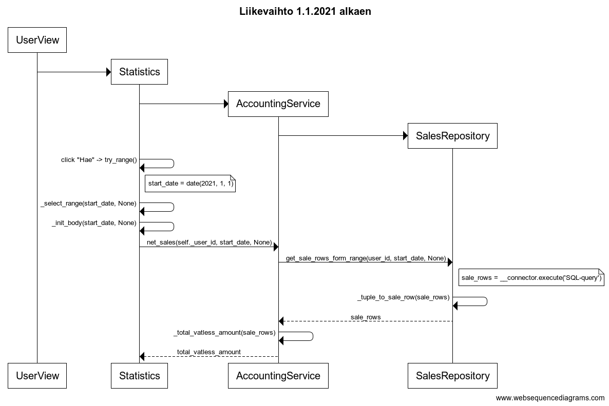

# Arkkitehtuuri

## Ohjelman rakenne

Src-kansiosta löytyy ohjelman alustukseen ja käynnistykseen liittyviä tiedostoja, sekä varsinaiseen toiminnallisuuteen liittyvät kansiot:
- `models` sisältää tietokohteita kuvaavia luokkia
- `repositories` kansion luokat vastaavat SQL-tietokannan kanssa kommunikoinnista
- `services` luokat vastaavat sovelluslogiikasta ja toimivat rajapintoina GUI-luokkien ja tietokantaoperaatioiden välillä
- `tests` sisältää ohjelman testit
- `views` sisältää graafisesta käyttöliittymästä vastaavat luokat

##### Pakkauskaavio


##### Pakkauskaavio luokilla


## Graafinen käyttöliittymä

Sovellus käynnistyy suorittamalla [index.py](../src/index.py)-tiedoston metodi `main`, joka alustaa ja käynnistää graafisen käyttöliittymän. Varsinaisesta käyttöliittymästä vastaavat luokat löytyvät [views](../src/views)-kansiosta. Käynnistyksen yhteydessä luodaan instanssi luokasta [UI](../src/views/ui.py), joka toimii käyttöliittymän juuriluokkana. Ohjelmassa on kaksi päänäkymää [HomeView](../src/views/home_view.py) ja [UserView](../src/views/user_view.py). `UI`-luokan `start`-metodi käynnistää kotinäkymän.

### HomeView

`HomeView` vastaa ohjelman koti-/aloitusnäkymästä. Näkymä koostuu headerista ja varsinaisesta sisällöstä, joita varten on omat luokkansa. Kaikki HomeView-näkymän luokat löytyvät home_view.py-tiedostosta.  
```
HomeView  
  _header -> Header  
  _body -> UsersMenu / InfoMenu
```
`Header` elementillä on kaksi painiketta, joilla voidaan kutsua `HomeView`-luokan metodeita kotinäkymän body-osion vaihtamiseksi

`InfoMenu`-luokka sisältää palvelun käyttöohjeet, ei muuta toiminnallisuutta.

`UsersMenu`-luokasta löytyy toiminto uuden käyttäjän lisäämiselle. Lisäksi luokka näyttää painikkeina olemassa olevat käyttäjät, joita painamalla pääsee navigoimaan toiselle päänäkymälle, josta vastaa `UserView`-luokka.

### UserView

`UserView` vastaa käyttäjän näkymästä, jossa käyttäjä voi lisätä uusia kirjanpitotapahtumia ja tarkastella yhteenvetoja lisätyistä tapahtumista. Kotinäkymän tavoin käyttäjänäkymällä on header-elementti navigointia varten ja kaksi varsinaista sisältönäkymää. Kaikki näkymistä vastaavat luokat löytyvät user_view.py-tiedostosta.  
```
UserView
  _header -> Header
  _body -> NewEvent / Statistics
```
`Header`-luokka toimii vastaavalla tavalla kuin aloitusnäkymän header, mutta lisänä on kolmas painike 'poistu', jonka avulla käyttäjä voi palata takaisin kotinäkymään.

`NewEvent`-luokka näyttää formin, jonka avulla käyttäjä voi lisätä uuden myynti- tai ostotapahtuman.

`Statistics`-luokka näyttää yhteenvedon käyttäjän kirjanpitotapahtumista.

## Sovelluslogiikka

Ohjelmassa olevat tietokohteet ovat käyttäjät sekä myynti- ja ostotapahtumat. Näitä edustaa models-kansion luokat [User](../src/models/user.py), [SaleRow](../src/models/sale_row.py) ja [ExpenseRow](../src/models/expense_row.py). Jokainen myynti- ja ostotapahtuma kuuluu yhdelle käyttäjälle, ja käyttäjillä voi olla useita tapahtumia.



Sovelluslogiikasta vastaa [services](../src/services)-kansion luokat [AccountingService](../src/services/accounting_service.py), [ExpenseRowService](../src/services/expense_row_service.py), [SaleRowService](../src/services/sale_row_service.py) sekä [UserService](../src/services/user_service.py). Näistä kolme viimeisintä toimii GUI:n käytössä olevina rajapintoina tiedon lisäämiselle ja haulle tietokannasta. Tiettyä tietokohdetta edustava service kommunikoi vastaavan repository-luokan kanssa, joka vastaa varsinaisista SQL-komennoista.

`AccountingService` hyödyntää myynneistä ja ostoista vastaavia repository-luokkia tiedon hakemiseen ja luo erilaisia tunnuslukuja ja yhteenvetoja sovelluksen käyttöön. `AccountingService`-luokkaa käytetään tiedon hakuun ja soveltamiseen, mutta muista serviceistä poiketen luokkaa ei käytetä tiedon pysyväistallennukseen.

## Tietokantaoperaatiot

Ohjelmassa tiedon pysyväistalletus toteutetaan SGLite-tietokantaan. Tietokannan alustuksessa [initialize_database](../src/initialize_db.py) mahdollisesti olemassa olevat taulut tuhotaan ja uusi tietokanta alustetaan. Tietokannan tauluja ovat _Users_, _Sales_ ja _Expenses_. Tietokanta tallennetaan [data](../data/)-kansioon. Polku ja tietokannan nimi määritellään tiedostossa [db_connector.py](../src/db_connector.py) dotenv-kirjastoa hyödyntäen. Ohjelman testauksessa ympäristö määritellään ennen _db_connector.py_-tiedoston lukemista tiedoston [pytest.ini](../pytest.ini) avulla. Näin testauksessa ei kosketa tuotantotietokantaan. Tuotanto- ja testitietokantojen nimet määritellään tiedostoissa [.env.prod](../.env.prod) ja [.env.test](../.env.test).

Ohjelman varsinaisista tietokantaoperaatioista vastaa _repositories_-kansion luokat [ExpensesRepository](../src/repositories/expenses_repository.py), [SalesRepository](../src/repositories/sales_repository.py) sekä [UserRepository](../src/repositories/user_repository.py). Kaikki repository-luokat hyödyntävät `db_connector`-oliota SQL-komentojen välittämiselle. Tietokantaoperaatiot ovat yksinkertaisia tiedon luomiseen ja hakuun liittyviä komentoja. Esimerkiksi `UserRepository`-luokalta löytyy komentoja:
- `create` -> luo uuden rivin Users-tauluun
- `get_user` -> hakee id:llä halutun käyttäjän tiedot ja palauttaa sitä vastaavan `User`-olion
- `get_all` -> hakee kaikki käyttäjät ja palauttaa listana `User`-olioita
- `delete_all` -> alustaa taulun

## Toiminnallisuudet

Toiminnallisuudet liittyvät (GUI:ssa navigoinnin lisäksi) pääasiassa jonkinlaisiin tietokantaoperaatioihin. Perusrakenne on tyypillisesti seuraava:
- jokin _view_ kutsuu _service_-luokkaa
- _service_ kutsuu _repositoryä_
- _repository_ toteuttaa tietokantaoperaation `db_connector`olion avulla

Jos tietoa luetaan:
- _repository_ siistii tietoa ja paluttaa _servicelle_ esim. `User`-olion tai listan olioita
- _service_ vastaavasti mahdollisesti jatkohyödyntää tietoa, ja palauttaa sen lopulta _view_-luokalle

Alla on kuvattu joitain esimerkkejä toiminnallisuuksista.

### Myyntitapahtuman lisäys

Käyttäjä pystyy luomaan myyntitapahtuman klikkaamalla käyttäjänäkymän (`UserView`) 'Lisää tapahtuma' -painiketta. Painike ohjaa formille, mistä valitaan tyypiksi 'Myynti' (oletusvalinta) ja syötetään pyydetyt tiedot:
- Päivämäärä
- Summa (sisältäen alvin). Erottimeksi käy piste tai pilkku, ohjelma huomioi korkeintaan kaksi desimaalia
- Alv-kanta, vaihtoehtoina 24%, 14%, 10% tai 0%
- Kuvaus. (merkkimäärä 1-50 merkkiä)

Formi informoi käyttäjää mahdollisten virheellisten syötteiden tapahtuessa. Kun tiedot on syötetty, tapahtuman saa lisättyä 'Lisää tapahtuma' -painikkeen avulla. Painike kutsuu `add_event`-metodia, joka validoi syötteet ja jos syöte on ok, lisätään tapahtuma tietokantaan. `UserView` kutsuu `SaleRowService`-luokan metodia `create_sale_row`, joka puolestaan kutsuu `SalesRepository`-luokan metodia `create`. Metodi lisää rivin sqlite3 connectorilla (`db_connector`) tietokantaan `Sales`-tauluun. Tapahtuma kuvattu alla sekvenssikaavion avulla.


### Liikevaihto halutulta aikaväliltä

Käyttäjänäkymän 'Kooste'-osiossa näkyy erilaisia tapahtumiin perustuvia tunnuslukuja. Näiden laskemisesta vastaa `AccountingService`-luokka. Oletusasetuksena on lukujen laskeminen kaikista tapahtumista (aikaväliksi on kovakoodattu 1.1.1.-31.12.9999), mutta lisäämällä 'Hae aikaväliltä' -kohtaan alku ja/tai lopetuspäivämäärän, luvut lasketaan uudestaan annettujen päivämäärärajojen mukaisesti.

'Hae'-nappia painamalla kutsutaan käyttäjänäkymän `Statistics`-luokan `try_range`-metodia, joka validoi syötteen ja sisäisten metodien kautta päivittää näkymän uusilla päivämääräasetuksilla. `Statistics`-luokasta kutsutaan haluttua `AccountingService`:n funktiota, joka on esimerkin tapauksessa `net_sales`. Funktio hakee ensin datan `SalesRepository`-luokan hakufunktiota kutsumalla ja laskee saatujen myyntitapahtumien perusteella liikevaihdon, joka palautetaan `Statistics`-luokan käyttöön. Alla on esimerkkinä sekvenssikaavio liikevaihdon hausta 1.1.2021 alkaen (eli loppupäivämäärä on tyhjä).



## Rajoitteet

### Toisteisuus

_Sale_ ja _Expense_-oliot sekä näitä käsittelevät servicet ja repositoryt muistuttavat vahvasti toisiaan, mutta luokat on silti pidetty erillisinä. Ratkaisu ei ole ideaali, mutta sillä on myös perusteensa:
- Reaalimaailmassa myynnit ja ostot ovat selkeästi erilaisia tapahtumia, ja laajemmassa sovelluksessa niillä olisi eri tyyppisiä ominaisuuksia.
- Kurssin aikana valmistuvassa versiossa tapahtumat ovat vielä käytännössä vastaavia, mutta mahdollisen jatkokehityksen myötä tapahtumiin tulisi eri piirteitä. Näin jatkokehitys on luultavasti selkeämpää, kun luokat ovat valmiiksi eroteltuina.

### Käyttöliittymä

GUI:sta vastaavien luokkien koodi ei ole kovin viimeisteltyä. Koodista löytyy mm. eri tyyppisiä ratkaisuja saman kaltaisiin ongelmiin. Esimerkiksi uuden käyttäjän lisäämisestä vastaava metodi `_create_user`-renderöi lisäämisen jälkeen koko näkymän, vaikka pelkästään käyttäjä-nappien päivitys riittäisi. Luokissa on myös jonkin verran toisteisuutta esimerkiksi tyylittelyihin liittyen.

Aloitusnäkymässä (`Users`) on joitain puutteita logiikan viimeistelyssä. Jos käyttäjä klikkaa 'Luo käyttäjä' kentän ollessa tyhjä, ei uutta käyttäjää luoda, mutta erillistä virheilmoitusta ei näytetä. Nimi-syötteen pituutta ei muutoin olla tällä hetkellä rajattu. Lisäksi käyttäjien määrää ei olla rajattu, mutta aloitusnäkymä ei kuitenkaan skaalaudu. Jos käyttäjiä on useita kymmeniä, loppuu aloitusnäkymästä tila kesken.
