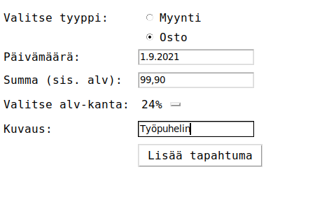

# Käyttöohjeet

## Asennus

Lataa ohjelmasta tehty release ja klikkaa __Source code (zip)__. Releaset on listattuna [README](../README.md)-tiedostossa ja käyttöohjeet on validit releasesta 'Viikko 6' alkaen.

1. Mene projektin juurikansioon ja asenna riippuvuudet komennolla:

```
poetry install
```

2. Tee alustus:

```
poetry run invoke initialize
```

3. Käynnistä sovellus:

```
poetry run invoke start
```

Ohjelman voi käytön jälkeen sulkea ja jatkossa käynnistää suoraan käynnistyskomennolla (kohta 3).
 
Ohjelman tietokannan voi nollata alustuskomennolla (kohta 2), jolloin kaikki kertynyt data poistetaan pysyvästi.  


## Ohjelman käyttö


Sovelluksen avulla voi pitää kirjaa toiminimen myynti- ja ostotapahtumista. Sovellus tarjoaa listauksen kirjatuista tapahtumista yhdenkertaisen
kirjanpidon periaatteella. Lisäksi sovellus näyttää yhteenvedon kassavirrasta, tuloslaskelmasta sekä alv-kertymästä. Sovellukseen voi luoda useita käyttäjiä.

## Kotivalikko
Sovelluksen käynnistys avaa kotivalikon, jossa on kaksi osiota: Info-osio sisältää sovelluksen käyttöohjeet.
Käyttäjät-osiosta pääsee luomaan uuden käyttäjän ja kirjautumaan olemassa olevana käyttäjänä.

## Käyttäjän luominen ja valitseminen.
Uuden käyttäjän saa luotua Käyttäjät-näkymästä lisäämällä halutun nimen ja klikkaamalla 'Luo käyttäjä'.
Luodut käyttäjät listataan alla sinisissä palkeissa. Palkkia klikkaamalla voi kirjautua kyseisen käyttäjän näkymään.


## Tapahtuman lisääminen
Navigoi Käyttäjä-näkymässä kohtaan 'Lisää tapahtuma'. Täytä vaaditut kentät seuraavasti:
- Valitse tyypiksi Myynti tai Osto
- Merkitse tapahtuman päivämäärä (esim. 1.1.2000)
- Merkitse summa (euroina), joka sisältää mahdollisen arvonlisäveron. Hyväksyttyjä syötteitä esim. '10', '10,5', '10.05'
- Valitse tapahtuman mukainen alv-kanta (24, 14, 10 tai 0 prosenttia)
- Lisää kuvaus (pituus 1-50 merkkiä)
Kun tiedot on syötetty, tapahtuman saa lisättyä klikkaamalla 'Luo tapahtuma'. Sovellus vahvistaa onnistuneen tapahtuman lisäämisen.



## Kooste
Käyttäjät-näkymän Kooste-osio näyttää kirjanpidon tapahtumista aikajärjestyksessä, myynnit ja ostot eroteltuna.
Lisäksi näkymästä löytyy seuraavat tunnusluvut:
- Kassavirta kertoo myynneistä kassaan (tilille) kertyneet rahat sekä ostoihin käytetyt rahat, sisältäen mahdolliset alvit.
- Tuloslaskelma näyttää myyntien ja ostojen summat (ilman alvia) sekä näiden erotuksen, eli tuloksen.
- Alv-laskelma näyttää myyntien sekä ostojen alvien summat sekä näiden erotuksen. Erotus kertoo verottajalle maksettavaksi jäävän alvin summan.

Kooste-osiossa tapahtumia voi hakea myös aikavälillä valitsemalla alku- ja/tai loppupäivämäärän muodossa 1.1.2000. Klikkaamalla 'Hae', Kooste-
osio päivittyy ja näyttää sekä tapahtumat että tunnusluvut valitun aikavälin mukaisesti.
Käyttäjä-näkymästä pääsee takaisin kotivalikkoon klikkaamalla punaista 'Poistu'-painiketta.


## Tapahtuman korjaaminen
Lisättyä tapahtumaa ei voi muokata tai poistaa. Virheellisen tapahtuman voi oikaista lisäämällä vastaava tapahtuma uudestaan,
mutta summa -merkkisenä. Näin tapahtumat kumoavat toisensa ja yhteisvaikutus on +/- 0.


