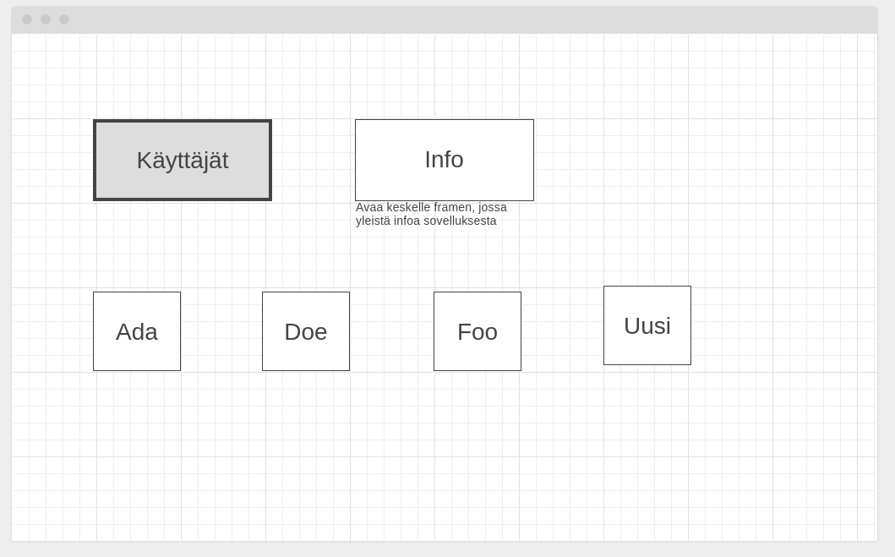
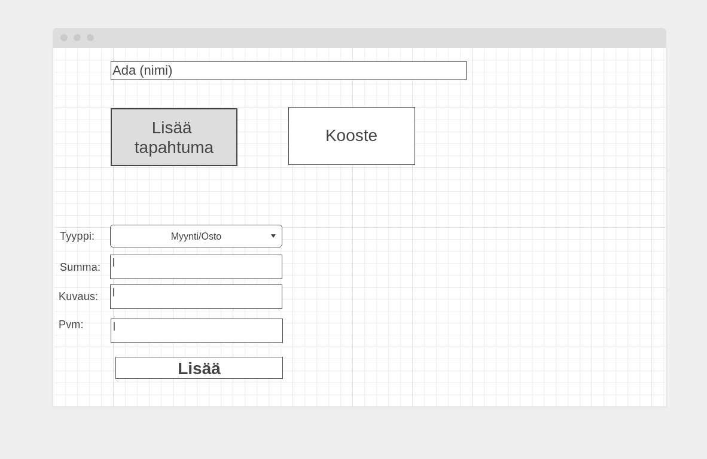
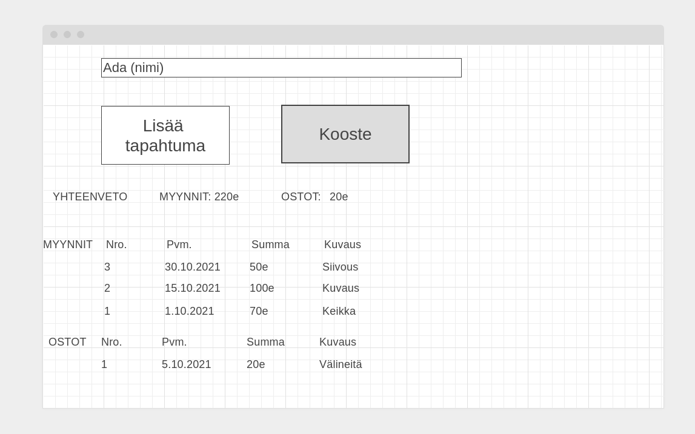

# Vaatimusmäärittely
### Sovelluksen tarkoitus
Tarkoituksena on toteuttaa työpöytäsovellus, jonka avulla käyttäjä(t) voi pitää kirjaa toiminimensä myynneistä ja ostoista.
Käyttäjä voi lisätä uusia myynti- tai ostotapahtumia ja sovellus koostaa näistä yhdenkertaisen kirjanpidon, tarjoaa yhteenvedon ja joitain yksinkertaisia tunnuslukuja käyttäjälle.

### Käyttäjät
Käyttäjärooliksi tulee aluksi peruskäyttäjä, joita voi olla useita. Lisäkehityksen myötä mahdollinen uusi rooli voisi olla ulkopuolinen tarkastaja, joka voisi katsoa käyttäjien tapahtumia ja lisätä niihin kommentteja, mutta ei muutoin muokata niitä. Toinen mahdollinen lisärooli on tekninen ylläpitäjä.

### Ominaisuudet
Kyseessä on työpöytäsovellus, joka sisältää yksinkertaisen graafisen käyttöliittymän. Liittymässä on aloitusnäkymä, josta voidaan navigoida käyttäjän näkymään tai luoda uusi käyttäjä.
Käyttäjänäkymässä käyttäjä voi lisätä uusia myynti- tai ostotapahtumia. Käyttäjänäkymästä näkee kertyneet tapahtumat ja niistä joitain tunnuslukuja/koosteita. Peruskoosteet ovat lista tapahtumista ja myyntien ja ostojen summat. Käyttäjät, myynnit ja ostot tallennetaan SQL-tietokantaan.

### Toteutus
Sovellus toimii erityisesti harjoituksena yksinkertaisen sovelluksen toteutukselle. Ensisijainen tavoite on toteuttaa yksinkertainen graafinen käyttöliittymä, joka tarjoaa perustoiminnallisuudet, tallentaa data tietokantaan ja sisältää toimivaa testausta.

Sovelluksen peruslogiikka on yksinkertainen, mutta aihe sen luontoinen, että edistymisen mukaan sovellusta on helppo laajentaa erilaisilla lisäominaisuuksilla. Mahdollisia laajennuksia on esimerkiksi:
- Alv lisääminen tapahtumiin
- Koosteet rajatuilta aikaväliltä
- Laajempaa statistiikkaa
- Tapahtumien muokkaus
- Eri tyyppisiä myyntejä ja ostoja
- Uudet käyttäjäroolit
- Käyttöliittymän visuaalinen hiominen

### Luonnoskuvia

